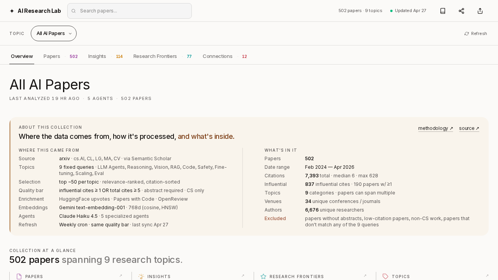
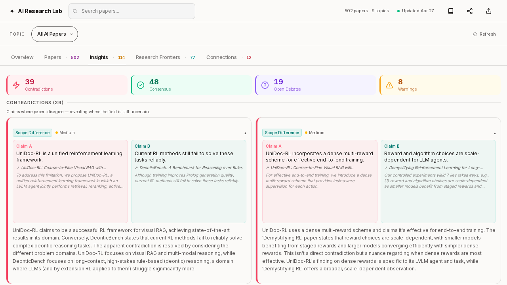
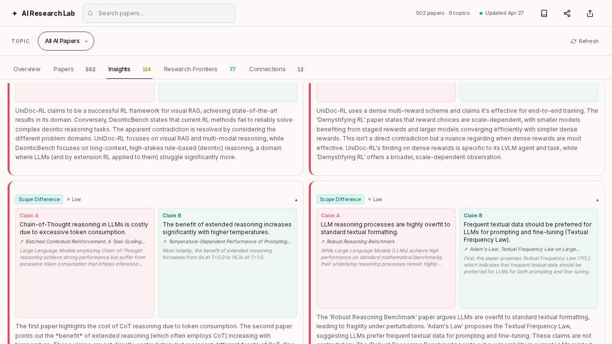
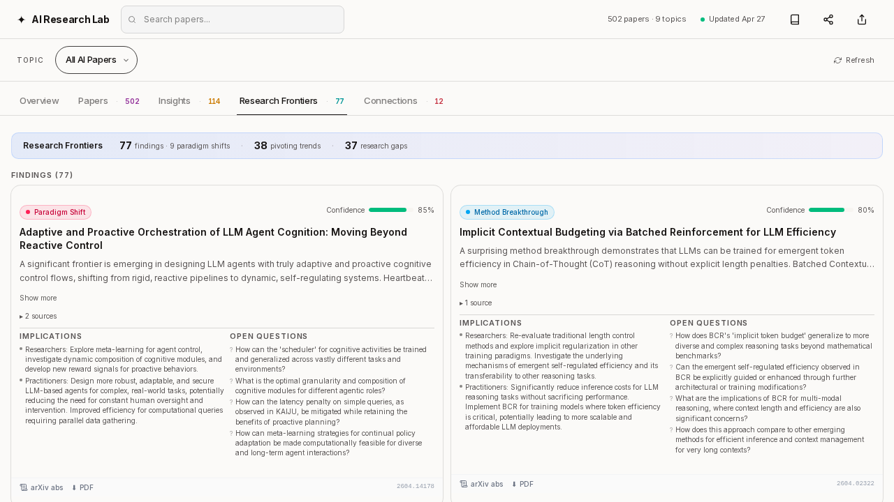
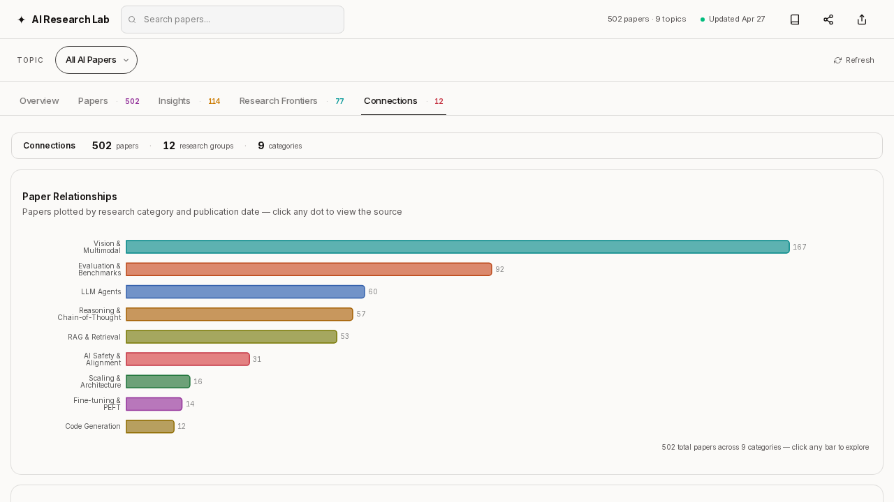
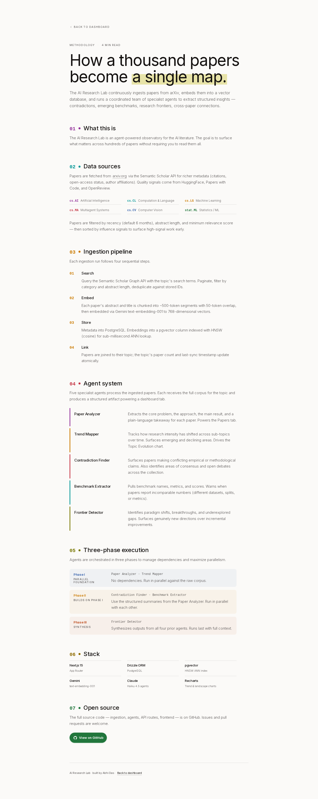
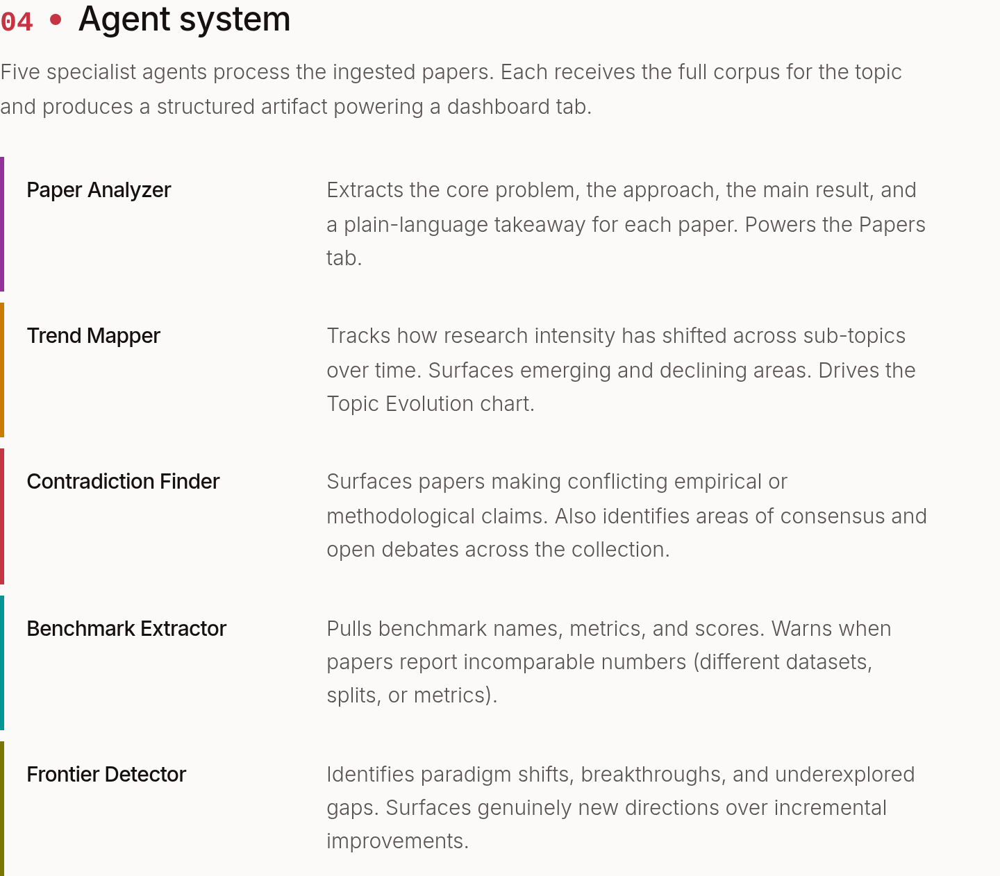

# AI Research Lab

**502 arxiv papers, read for you.** Five specialized agents surface the contradictions, consensus, and frontiers across nine AI subfields — in plain English.

[**Live app → airesearchlab.space**](https://www.airesearchlab.space) · [Methodology](https://www.airesearchlab.space/methodology) · [Vote on Product Hunt ↗](https://www.producthunt.com/products/ai-research-lab) · [Read the essay on Substack ↗](https://abhid.substack.com/p/what-502-high-signal-ai-papers-actually) · [MIT license](#license)



---

## What this is

Most "AI for papers" tools answer questions about *one* paper at a time. The interesting signal is across papers — where do they disagree, where have they converged, what's actually still open.

AI Research Lab is a free, open-source observatory built around that question. You pick one of nine AI subfields — agent evaluation, multi-agent systems, RLHF, reasoning models, RAG, vision-language, code generation, alignment, robotics — and a multi-agent pipeline gives you back five tabs of structured findings. Every claim links back to an arxiv paper. Nothing is invented. Things the agents weren't sure about are explicitly excluded with a reason.

**The numbers as of this week:**

- **502 papers** ingested across nine topics (Feb 2024 → Apr 2026, ranked by citations + influence)
- **7,393 citations** mapped via Semantic Scholar; **837** flagged as influential
- **39 contradictions** surfaced where the field is openly fighting
- **48 consensus findings**, **19 open debates**, **8 warnings** extracted
- **5 specialized agents** doing the reading
- **Weekly cron** keeps the corpus fresh

---

## The five tabs

Each topic page renders five tabs, in increasing order of opinion: from "what is this field" to "where is it going next."

### Insights — the differentiator

Four categories: **Key Insights** (what the field broadly agrees on), **Contradictions** (where it's openly fighting), **Open Debates** (where the question isn't settled), and **Consensus Items** (claims with multiple independent papers behind them).



The contradictions are the part most people fake in dinner conversations. Here's what one looks like rendered:



Two claims, side by side. Each side names its supporting papers and the specific benchmarks they ran. You don't get a thinkpiece — you get the structure of the disagreement and the evidence behind both sides.

### Research Frontiers — what's next

The Frontier Detector looks for paradigm shifts: places where the field is starting to organize around a new idea but hasn't fully named it yet.



Each frontier card includes the proposed shift, the cluster of supporting papers, the open questions, and what would have to be true for the shift to actually land.

### Connections — the social graph of the field

Who is publishing with whom. Which institutions are clustering around which subfield. The closest thing to a literature review you'll get without writing one yourself.



### Papers — the underlying corpus

The raw list, with category pills for `cs.AI`, `cs.CL`, `cs.LG`, `cs.MA`, `cs.CV`, plus arxiv links and citation counts. Use it to second-guess the agents — pull the source material yourself and check whether the synthesis on the Insights tab is fair.

### Overview — the briefing room

The executive summary. Land here and within one screen you know the size of the field, the current activity level, and the top frontier cards.

---

## Methodology is the feature

Most products skip this. AI Research Lab has a dedicated methodology page that exposes the entire pipeline.



Every data source is named. Every model is named. Every transformation step has a sentence. **Every agent prompt is published.** If an agent makes a claim on the Insights tab, you can trace it: which papers fed it, which embedding model retrieved them, which agent wrote it, when it last ran.



The five agents:

| Agent | Job |
|---|---|
| **Paper Analyzer** | Reads each paper's abstract + chunks; extracts contribution, method, benchmarks, limitations into a structured object |
| **Trend Mapper** | Clusters papers by topic-within-topic; tracks publication velocity |
| **Contradiction Finder** | Anchors every claim to a paper chunk or excludes it. No anchor, no card. |
| **Benchmark Extractor** | Pulls every named benchmark and the score deltas claimed against it |
| **Frontier Detector** | Proposes paradigm shifts. Highest-variance agent. Required to name a candidate label, a supporting cluster, and the open questions. |

There's no "trust me" anywhere on the page. If the agents are wrong, you should be able to find out *why* before you form an opinion based on it.

---

## Architecture

```
┌───────────────────────────────────────────────────────────────┐
│                          Frontend                              │
│              Next.js 15 App Router · 5-tab UI per topic        │
│   Overview · Insights · Connections · Papers · Frontiers       │
└───────────────────────────────┬───────────────────────────────┘
                                │  structured JSON
┌───────────────────────────────▼───────────────────────────────┐
│                     Agent Orchestrator                          │
│  ┌────────────┐ ┌────────────┐ ┌──────────────────────┐        │
│  │  Paper     │ │  Trend     │ │  Contradiction       │        │
│  │  Analyzer  │ │  Mapper    │ │  Finder              │        │
│  └────────────┘ └────────────┘ └──────────────────────┘        │
│  ┌────────────┐ ┌──────────────────────┐                       │
│  │  Benchmark │ │  Frontier Detector   │                       │
│  │  Extractor │ │                      │                       │
│  └────────────┘ └──────────────────────┘                       │
└───────────────────────────────┬───────────────────────────────┘
                                │
┌───────────────────────────────▼───────────────────────────────┐
│                       Knowledge Layer                          │
│  ┌────────────────┐  ┌─────────────┐  ┌───────────────────┐   │
│  │ PostgreSQL     │  │ Gemini      │  │ arxiv API +       │   │
│  │ + pgvector     │  │ embeddings  │  │ Semantic Scholar  │   │
│  │ (HNSW cosine)  │  │ (768d)      │  │ (citations)       │   │
│  └────────────────┘  └─────────────┘  └───────────────────┘   │
└───────────────────────────────────────────────────────────────┘
```

**Pipeline:** arxiv API → ~500-token chunks with overlap → Gemini `text-embedding-001` → Postgres + pgvector via Drizzle → 5 specialized agents reason over retrieved chunks → structured JSON → 5-tab UI.

**Hosting:** Cloud Run + Cloud SQL. Weekly cron re-ingests, re-runs agents, re-renders artifacts.

**Cost:** Total cost per topic refresh is well under $1.

---

## Tech stack — Google Cloud end-to-end

- **Hosting** — Cloud Run (Next.js app + agent orchestrator)
- **Database** — Cloud SQL + pgvector (HNSW cosine ANN — single DB to operate)
- **Embeddings** — Gemini `text-embedding-001` (768d)
- **Container pipeline** — Artifact Registry
- **Cron** — Cloud Scheduler triggers `/api/cron/ingest` weekly
- **Launch video** — Veo
- **Frontend** — Next.js 15 App Router · React · TypeScript · Tailwind v4 · shadcn/ui · Recharts
- **Agents** — instruct-tuned LLM, structured-JSON output mode
- **Paper source** — arxiv API + Semantic Scholar (citations)

Total cost per topic refresh: under $1.

---

## Getting started

### 1. Clone and install

```bash
git clone https://github.com/abhid1234/AI-research-lab.git
cd AI-research-lab
pnpm install
```

### 2. Set up environment

```bash
cp .env.example .env.local
# Add your API keys (see .env.example for required vars)
```

### 3. Start the database

```bash
docker compose up -d
pnpm db:setup
pnpm db:push
```

### 4. Seed with demo data (no API keys needed)

```bash
pnpm seed
```

Inserts pre-built papers + pre-generated artifacts so all 5 dashboard tabs render immediately without any API calls.

### 5. Start the app

```bash
# Terminal 1: background worker (handles ingestion + analysis jobs)
pnpm worker

# Terminal 2: frontend
pnpm dev
```

Open [http://localhost:3000](http://localhost:3000).

### Ingest real papers (requires API keys)

```bash
pnpm ingest -- --topic "LLM agents" --count 20
pnpm analyze -- --topic "LLM agents"
```

---

## Forking for a different corpus

The bones are general — if you want a multi-agent observatory over a different corpus (legal opinions, biotech preprints, security advisories, internal company docs), the pipeline is roughly:

1. Replace the arxiv ingest in `src/ingestion/` with your source
2. Adjust chunk size in `src/ingestion/chunker.ts` for your document type
3. Rewrite the 5 agent prompts in `src/agents/` for your domain (the published prompts are a starting point, not a constraint)
4. The 5-tab artifact viewer in `src/components/artifacts/` is corpus-agnostic — it just renders whatever structured JSON the agents emit

Open to PRs that generalize the corpus loader.

---

## What's next

Roadmap, in order:

1. **Personal topic ingestion** — drop in an arxiv ID or a search query and get a one-off observatory for whatever corpus you care about
2. **Better cross-topic connections** — surface the paper that bridges, say, *agent evaluation* and *RLHF*
3. **Email digest** — one Monday-morning sentence-per-topic email
4. **More topics** — current nine were chosen because they're the ones I personally care about. Open to PRs.

---

## Related projects

- [agent-kit](https://github.com/abhid1234/agent-kit) — Multi-agent orchestration framework (used for the agent layer)
- [MindWeave](https://github.com/abhid1234/MindWeave) — AI knowledge hub (shares embedding/search patterns)
- [autoresearch-experiments](https://github.com/abhid1234/autoresearch-experiments) — Karpathy's autoresearch on a budget

Inspired by [@omarsar0's DAIR Papers Observatory](https://x.com/omarsar0/status/2033966663855448410).

---

## License

MIT — see [LICENSE](LICENSE).

---

## Author

Built by [Abhi Das](https://github.com/abhid1234) on weekends with an AI coding agent as the pair.

Read the long-form story behind it: [What 502 high-signal AI papers actually say — without the academic syntax](https://abhid.substack.com/p/what-502-high-signal-ai-papers-actually) on Substack.
